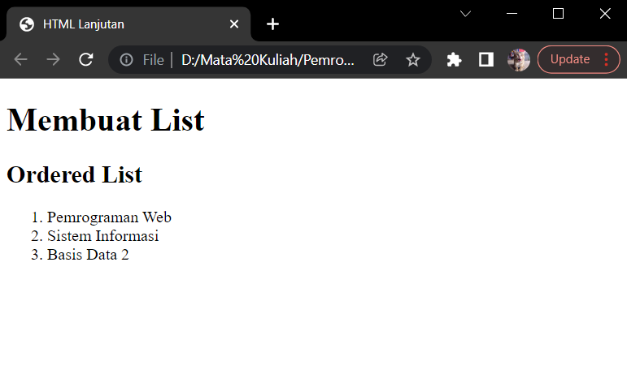
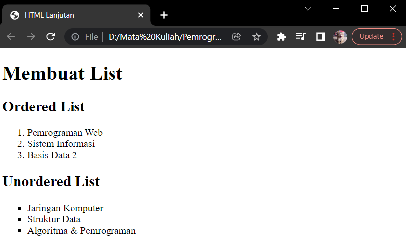
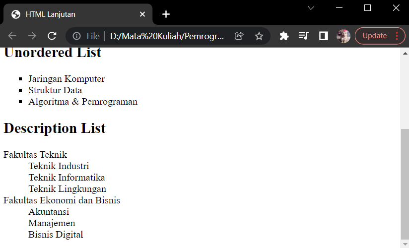
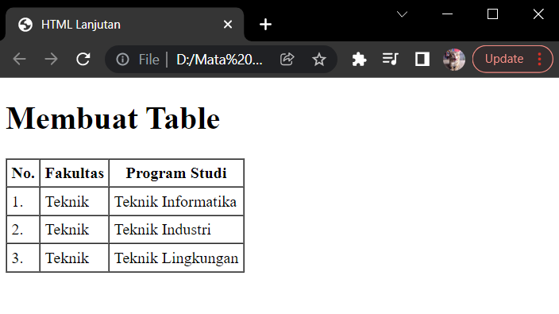
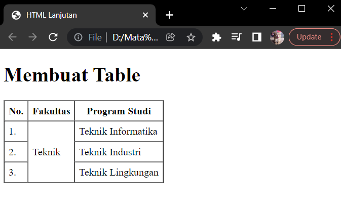
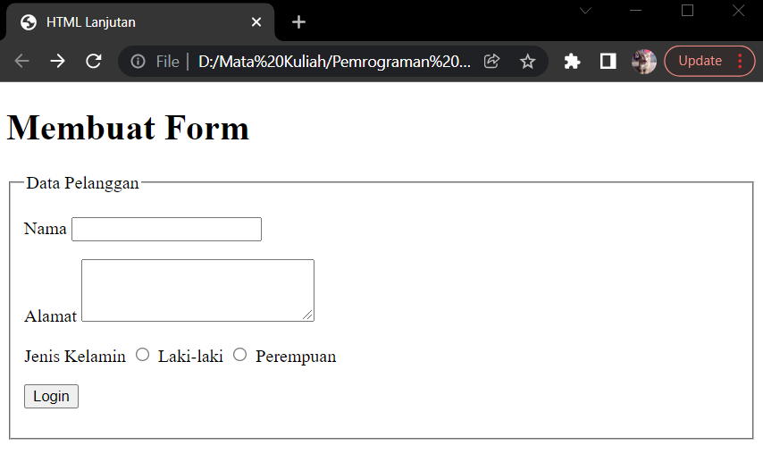
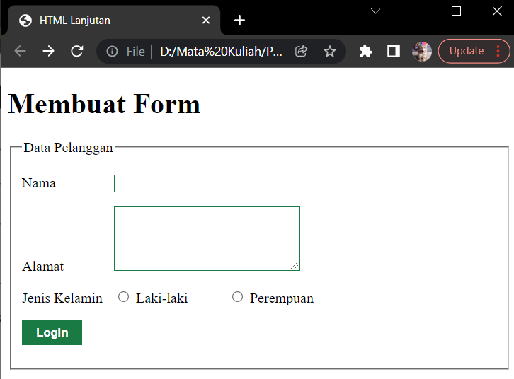
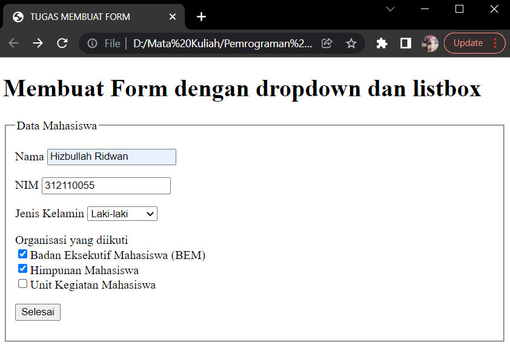

# Latihan membuat Table, List, dan Form HTML

* Nama          : Hizbullah Ridwan
* NIM           : 312110055
* Kelas         : TI.21.B.1
* Mata Kuliah   : Pemrograman Web

Dalam latihan menggunakan CSS ini, saya menggunakan [Google Chrome](https://www.google.com/intl/id_id/chrome/) sebagai web browser dan [visual studio code](https://code.visualstudio.com/) sebagai teks editornya.     

Daftar isi :          
* [Membuat Ordered List](https://github.com/Ridwanwildan/Lab3Web#membuat-ordered-list)         
* [Membuat Unordered List](https://github.com/Ridwanwildan/Lab3Web#membuat-unordered-list)         
* [Membuat Description List](https://github.com/Ridwanwildan/Lab3Web#membuat-description-list)         
* [Membuat Tabel](https://github.com/Ridwanwildan/Lab3Web#membuat-tabel)         
* [Menambahkan Margin dan Padding](https://github.com/Ridwanwildan/Lab3Web#menambahkan-margin-dan-padding)         
* [Menggabungkan Sel Data](https://github.com/Ridwanwildan/Lab3Web#menggabungkan-sel-data)         
* [Menambahkan Form](https://github.com/Ridwanwildan/Lab3Web#menambahkan-form)         
* [Menambahkan Style pada Form](https://github.com/Ridwanwildan/Lab3Web#menambahkan-style-pada-form)         
* [Pertanyaan dan Tugas](https://github.com/Ridwanwildan/Lab3Web#pertanyaan-dan-tugas)         

## Membuat Ordered List

Pertama adalah membuat list, untuk membuat list caranya adalah dengan membuat tag `<ol>`         
dan didalamnya ditambahkan tag `<li>`. Daftar list akan ditulis dalam tag `<li>` dan akan otomatis        
ada angkanya.          

```bash
<body>
    <header>
        <h1>Membuat List</h1>
    </header>
    <section id="order-list">
        <h2>Ordered List</h2>
        <ol>
            <li>Pemrograman Web</li>
            <li>Sistem Informasi</li>
            <li>Basis Data 2</li>
        </ol>
    </section>
</body>

```         

       

## Membuat Unordered List

Unordered list adalah list tetapi tanpa adanya angka seperti ordered list, untuk membuatnya adalah         
dengan menambahkan tag `<ul>` dan didalamnya ditambahkan tag `<li>`. Nantinya list akan ditandai dengan     
tanda dot.               

```bash
<section id="unorder-list">
    <h2>Unordered List</h2>
    <ul type="square">
        <li>Jaringan Komputer</li>
        <li>Struktur Data</li>
        <li>Algoritma &amp; Pemrograman</li>
    </ul>
</section>
```         

       

## Membuat Description List

Untuk membuat description list caranya adalah menambahkan tag `<dl>` kemudian didalamnya tambahkan tag `<dt>`       
dan juga `<dd>`.               

```bash
<section id="unorder-list">
    <h2>Description List</h2>
    <dl>
        <dt>Fakultas Teknik</dt>
        <dd>Teknik Industri</dd>
        <dd>Teknik Informatika</dd>
        <dd>Teknik Lingkungan</dd>
        <dt>Fakultas Ekonomi dan Bisnis</dt>
        <dd>Akuntansi</dd>
        <dd>Manajemen</dd>
        <dd>Bisnis Digital</dd>
    </dl>
</section>
```         

       

## Membuat Tabel

Tabel pada HTML bisa ditambahkan cukup mudah. Caranya dengan menambahkan tag `<table>` dan        
didalamnya ditambahkan tag `<thead>` sebagai kolom yang paling atas dan `<tbody>` sebagai kolom dibawahnya.       
Selanjutnya ada tag `<tr>` yang digunakan untuk membuat kolom, dan ada juga tag `<td>` untuk setiap cellnya.       

```bash
<table border="1" cellpadding="4" cellspacing="0">
    <thead>
        <tr>
            <th>No.</th>
            <th>Fakultas</th>
            <th>Program Studi</th>
        </tr>
    </thead>
    <tbody>
        <tr>
            <td>1.</td>
            <td>Teknik</td>
            <td>Teknik Informatika</td>
        </tr>
        <tr>
            <td>2.</td>
            <td>Teknik</td>
            <td>Teknik Industri</td>
        </tr>
        <tr>
            <td>3.</td>
            <td>Teknik</td>
            <td>Teknik Lingkungan</td>
        </tr>
    </tbody>
</table>
```         

       

## Menambahkan Margin dan Padding

Menambahkan margin dan padding artinya menambahkan space pada tabel. Margin dan padding ditambahkan supaya        
tabel terlihat lebih luas dan ukurannya sesuai. Cara menambahkan margin dan padding adalah dengan menambahkan      
atribut `cellpadding` untuk padding, dan `cellspacing` untuk margin. Sedangkan atribut `border` digunakan     
untuk mengatur border width.        

```bash
<table border="1" cellpadding="4" cellspacing="0">
```         

## Menggabungkan Sel Data

Setiap sel data pada table bisa digabungkan baik itu digabungkan secara horizontal dengan memakai         
atribut `colspan` maupun digabungkan secara vertikal dengan memakai atribut `rowspan`. Seperti ini :        

```bash
<table border="1" cellpadding="6" cellspacing="0">
    <thead>
        <tr>
            <th>No.</th>
            <th>Fakultas</th>
            <th>Program Studi</th>
        </tr>
    </thead>
    <tbody>
        <tr>
            <td>1.</td>
            <td rowspan="3">Teknik</td>
            <td>Teknik Informatika</td>
        </tr>
        <tr>
            <td>2.</td>
            <td>Teknik Industri</td>
        </tr>
        <tr>
            <td>3.</td>
            <td>Teknik Lingkungan</td>
        </tr>
    </tbody>
</table>
```         

       

## Menambahkan Form

Untuk menambahkan form, perlu ditambahkan beberapa tag seperti `<form>`, `<fieldset>`, `<label>`,            
`<input>`, dan `<textarea>`. Kemudian supaya value seperti nama, alamat, dan lain sebagainya bisa tersimpan      
kedalam database, maka perlu ditambahkan atribut `action` dan `method` didalam tag `<form>`.           

```bash
<form action="proses.php" method="post">
    <fieldset>
        <legend>Data Pelanggan</legend>
        <p>
            <label for="nama">Nama</label>
            <input type="text" id="nama" name="nama">
        </p>
        <p>
            <label for="alamat">Alamat</label>
            <textarea id="alamat" name="alamat" cols="20" rows="3"></textarea>
        </p>
        <p>
            <label>Jenis Kelamin</label>
            <input id="jk_l" type="radio" name="kelamin" value="L" />
            <label for="jk_l">Laki-laki</label>
            <input id="jk_p" type="radio" name="kelamin" value="P" />
            <label for="jk_p">Perempuan</label>
        </p>
        <p>
            <input type="submit" value="Login">
        </p>
    </fieldset>
</form>
```         

       

## Menambahkan Style pada Form

Untuk melakukan styling pada form HTML yang sudah dibuat, digunakan CSS seperti dibawah ini :         

```bash
<style>
form p > label {
    display: inline-block;
    width: 100px;
}
form input[type="text"], form textarea {
    border: 1px solid #197a43;
}
form input[type="submit"] {
    border: 1px solid #197a43;
    background-color: #197a43;
    color: #ffffff;
    font-weight: bold;
    padding: 5px 15px;
}
</style>
```         

       

## Pertanyaan dan Tugas

Buatlah form yang menampilkan dropdown menu dan listbox dengan multiple selection            
[Contoh Form dengan dropdown dan listbox multiple selection](https://github.com/Ridwanwildan/Lab3Web/blob/main/tugas.html)             

       